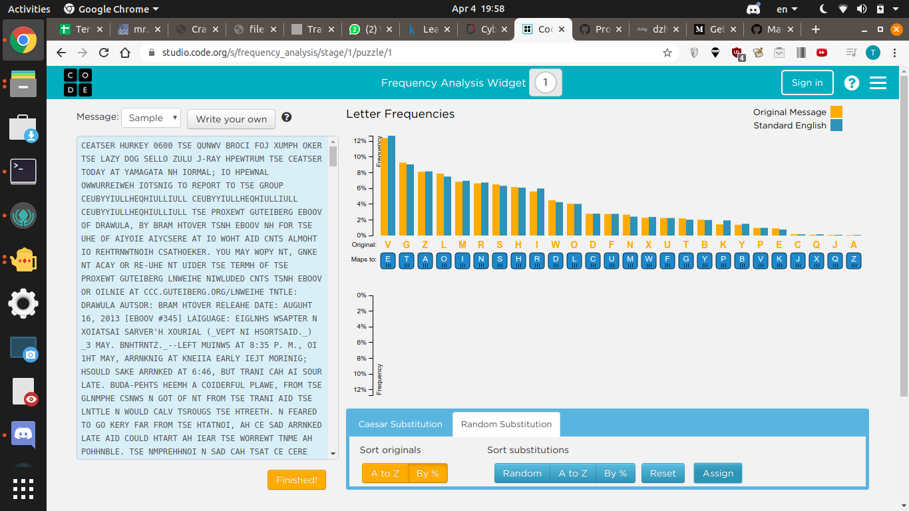

# Substitution Ciphers
100 Points, Data Science

## Description
There are patterns in most things we create, these patterns can be used to study and recover data. In this challenge we will be using the naturally observed frequencies of English words and letters to decode a cipher text made by a simple substitution cipher.

English like most other languages has letter frequencies associated with it:
- See https://commons.wikimedia.org/wiki/File:English_letter_frequency_(alphabetic).svg
- See https://en.wikipedia.org/wiki/Frequency_analysis

You may find this tool useful: https://studio.code.org/s/frequency_analysis
FLAG IS IN ALL CAPS WITH CTFSG{####} FORMAT

# Solution
Using [this website](https://studio.code.org/s/frequency_analysis), 
match the letters by frequency, and you fill get this



However, you notice there are some letters off, like `FOJ`, instead of `FOX`. Just do a few substitutions (switch J and X substitutions) and you get something resembling English.


After that just use Ctrl-F "CTFSG{" to find the Flag in the Text
```
IT MADE AN INSTANT CHANGE IN HIM, FOR THE FURY PASSED SO QUICKLY THAT I COULD HARDLY BELIEVE THAT IT WAS EVER THERE. "TAKE CARE," HE SAID, "TAKE CARE HOW YOU CUT YOURSELF. IT IS MORE CTFSG{GOT_FREQUENCIES_BUTWHEREARETHEWAVELENGTHS} DANGEROUS THAN YOU THINK IN THIS COUNTRY." THEN SEIZING THE SHAVING GLASS, HE WENT ON:
```
# Flag
`CTFSG{GOT_FREQUENCIES_BUTWHEREARETHEWAVELENGTHS}`
